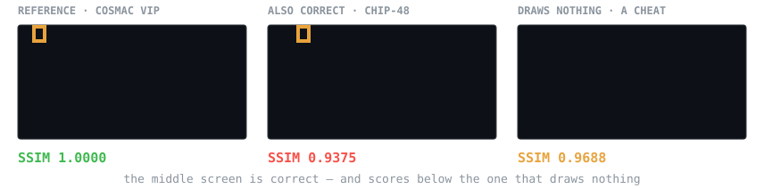
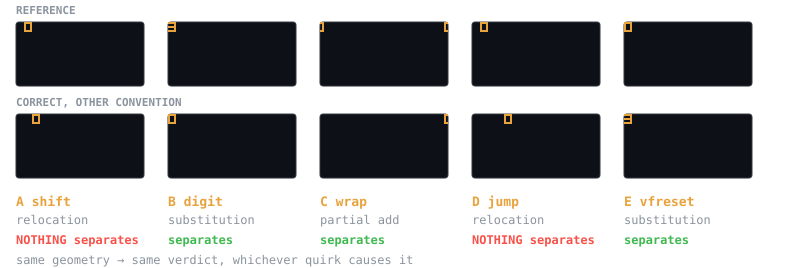
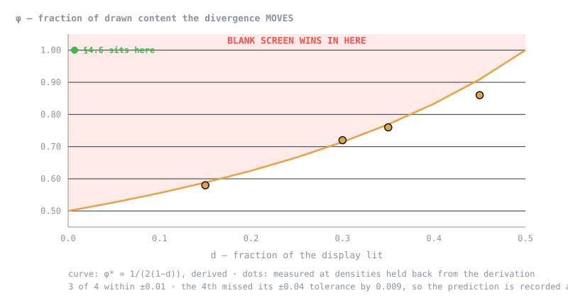

# vaudit

### A correct emulator scored below a blank screen. Here is exactly when that happens.

I wrote five CHIP-8 ROMs, each isolating one documented platform quirk, each with its expected
frames and its falsifiers registered **before the bytes existed**. Scored against seven
third-party interpreters by the five grading strategies a published emulator benchmark actually
tried, three of those strategies rank a **blank screen above a correct implementation** — not an
adversarial input, just two conventions that disagree about one instruction. A follow-up study
then falsified four of its own predictions and bounded the result in closed form.



Both left-hand screens are right. The COSMAC VIP reads `8XY6` as "shift VY into VX"; CHIP-48 and
SUPER-CHIP shift VX in place. Real interpreters do both. So the glyph lands four pixels apart —
and the grader ranks that legitimate difference *below* a submission that renders nothing.

**Why this matters for RL:** a grader like this is the reward signal. Ranking a correct
implementation below one that does nothing doesn't waste that rollout's compute — it spends it
teaching the model that correct behaviour is wrong.

📄 **[The write-up](docs/blank-screen-wins.html)** (self-contained HTML — open it locally, or enable GitHub Pages on `docs/`) · 🔬 [Method and full results](WRITEUP.md) ·
📋 [Pre-registration](PREDICTIONS.md) · 📚 [What was already known](LITERATURE.md)

---

## The five ROMs



| ROM | Quirk | Kind | Blocks | Worst correct | Blank | Separates? |
|---|---|---|---:|---:|---:|---|
| **A** `shift` | `8XY6` shift source | relocation | 2 | **0.9375** | 0.9688 | **none of the five** |
| **B** `digit` | `FX55` index increment | substitution | 1 | 0.9943 | 0.9688 | pixel prop., SSIM |
| **C** `wrap` | sprite wrap vs clip | partial addition | 1 | 0.9688 | 0.9375 | pixel prop., SSIM |
| **D** `jump` | `BNNN` jump offset | relocation | 2 | **0.9375** | 0.9688 | **none of the five** |
| **E** `vfreset` | `8XY1` VF reset | substitution | 1 | 0.9943 | 0.9688 | pixel prop., SSIM |

**Geometry predicts the verdict; the quirk that caused it does not.** D reaches relocation through
a completely different instruction — `BNNN` adds `V0` on the VIP and `VX` on CHIP-48, so the two
conventions jump to *different instructions* — and reproduces A to four decimals. E reaches
substitution through a register that can't be drawn at all, routing the VF flag into the font
index. Both were registered as replications before they were built; either behaving differently
would have meant the mechanism was wrong.

**The mechanism.** SSIM pools over blocks. Moving a glyph four pixels disturbs **two** 8×8 blocks —
the one it left and the one it entered — while erasing it entirely disturbs **one**. A metric that
averages over blocks therefore penalises relocation more than deletion.

---

## Where the failure stops — the part I got wrong

The obvious objection is that a 64×32 display with 14 lit pixels is 0.68% lit, so a blank frame is
99.3% pixel-correct before any metric runs. Answering it needs two parameters: the lit fraction
**d**, and **φ**, the fraction of drawn content the divergence *moves*.

I registered the boundary as `φ > 0.5`, independent of density, and called it arithmetic rather
than a guess. **It was wrong** — it dropped the collision term, because displaced content doesn't
always land on dark pixels:

```
blank frame       differs in  d·N
displaced frame   differs in  2·φ·d·N·(1−d)      ← (1−d) is the free landing sites

blank wins  ⟺  φ·(1−d) > ½        ⟺        φ* = 1 / (2(1−d))
```



The curve leaves the unit square at **d = 0.5**: above half-lit, no amount of movement lets a blank
frame win. The correction reached me *after* the first sweep, so I held four densities back and
predicted them in advance to ±0.04 — three landed inside ±0.01, the fourth missed its tolerance by
0.009, and **the prediction is recorded as falsified.**

> **This costs the headline its generality, and I pre-committed to saying so.** At 240×160 with
> realistic density and one displaced sprite, all three metrics rank the correct divergence far
> above a blank frame (SSIM **0.9870** vs **0.3033**). The failure is a property of sparse displays
> where nearly all the drawn content moves. **It is not a claim that anyone's shipping grader
> mis-ranks their submissions.**

What survives is more useful than the headline was: **a boundary you can check your own grader
against.** Measure what fraction of drawn content your divergence moves, measure how much of the
display is lit, and see which side of `φ(1−d) = ½` you land on. For SSIM, measure block occupancy
instead — at identical density a blank frame scores **0.9683** against a 19-block layout and
**0.0027** against a 600-block one.

---

## What a verifier has to do

Reject every cheat, accept every legitimate solution, and return the same verdict twice. Tooling
exists for the first. This measures the other two.

```
4a  honest_pass  = accepted / |{s : oracle(s) = 1}|      correct work the grader accepts
4e  catch_rate   = rejected / |{m : oracle(m) = 0}|      broken work the grader rejects
4b  flake_rate   = unstable / |{submissions x m runs}|   verdicts that change on rerun
4b′              does the grader's own harness exercise what the rollout exercises?
4c               what does the grader assert that the prompt never made derivable?
```

`4a` and `4e` are deliberately the same shape — sensitivity and specificity against the oracle.
Either is trivially maxed alone (accept everything, reject everything), so **neither is ever
reported without the other beside it**, and every number carries the population it was computed
over.

| | |
|---|---|
| **The population** | 7 third-party CHIP-8 interpreters, adapted to a headless harness, every modification typed and tested in [`ADAPTERS.md`](ADAPTERS.md) |
| **The ROMs** | 5 authored, 12–34 bytes each, source published beside the bytes, 5 acceptance gates |
| **Correctness** | adjudicated by the test ROM's own pass/fail marks read positionally — not by agreement with my implementation |
| **Upstream** | 6 bug reports filed across 4 repos, each traced to a line in their own source, all still open. 2 further defects are **unreported** — `wyattferguson` and `debugloop` both have issues disabled |

```bash
uv sync
python -m vaudit.tasks.chip8.fetch    # population + ROMs at pinned commits
make check                            # 188 tests, offline, no API key
```

Run `make check` *before* fetching and you get 139 passed, 19 skipped — the adapter tests skip
cleanly when the population is absent, so the suite can never go green while silently claiming a
study that did not run.

---

## Honest limitations

- **Sample sizes are small.** 5 EvalPlus tasks with mutant denominators of 4 and 8; 7 interpreters,
  a convenience sample; 5 ROMs.
- **Nothing here is a new idea.** `catch_rate` is the mutation score, automated by tools since the
  1980s. SSIM's translation sensitivity is documented with a purpose-built fix (CW-SSIM, 2005).
  [`LITERATURE.md`](LITERATURE.md) is unsparing about it and names what survives.
- **Two of the five ROMs are inert as population tests.** On D and E all seven interpreters agree,
  so those divergent frames come from my own quirk-configured harness. The population varies on
  **three** of the five documented quirks — the quirks that divide real implementations are a
  subset of those that divide the documentation.
- **One result has no reproduce path** in this repository, and says so where it appears.

**Prediction scorecard: 14 evaluated — 8 hit, 1 marginal, 1 split, 4 missed.** The four misses come
from the study that bounded the headline, which is why that study is the most useful thing here.

---

## The incident record

While building an instrument to catch measurements that are about the wrong thing, this project
made that mistake **eighteen times** — sixteen of them introduced by the model doing the work.
Each has a traced cause, and none was caught by the thing it broke failing at the moment it broke.
They fall into four patterns, each with a direct analogue in building RL graders: the check that
wasn't running, the claim wider than the thing verified, scaffolding mistaken for the subject's
behaviour, and the fixture that couldn't show what it was built to show.

The most recent: ROMs D and E cleared all four acceptance gates while testing nothing about the
population, because the gates required a split in prose and never checked for one. There is now a
fifth gate, and both ROMs fail it.

→ [`WRITEUP.md` §2 and Appendix A](WRITEUP.md)

---

## Origin

This began as my solo continuation of **Goodhart**, a two-day project from the HUD Frontier / RSI
RL Environments hackathon (20–21 June 2026) built with [Advay Monga](https://github.com/advaymonga)
and [rayan-arya](https://github.com/rayan-arya), which placed 9th of 71. My contribution there was
the event bus, dashboard, and leaderboard frontend — not the verifier core.

This repository shares no code with it. The sandbox, substrate loader, grader, and oracle are
written from scratch here (and the sandbox drops the test-framework dependency the original had,
which made every sandboxed run roughly ten times cheaper). Everything in `audit/`, `isolation.py`,
and `tasks/` is mine. The original remains with its authors.

One finding did come out of that work and is worth recording: the original sealed harness
tampering by rebuilding its test suite from the task, but a candidate could still read the
expected values out of the generated module's namespace. `isolation.py` closes that by putting a
process boundary between the candidate and the answers — the child receives only the inputs.

**Authorship.** Built with Claude Code. I set the direction, made the scoping calls, reviewed the
output and pushed back on it — including the eligibility amendments, the decision not to weaken
the correctness bar, and the literature search that cost the project its novelty claims.
